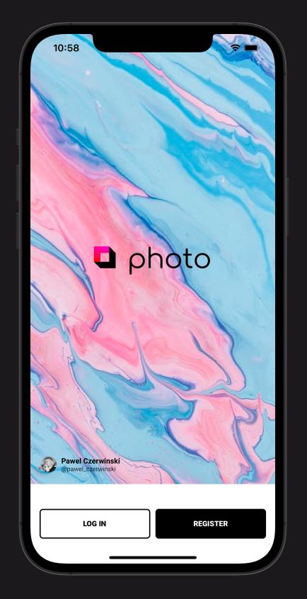
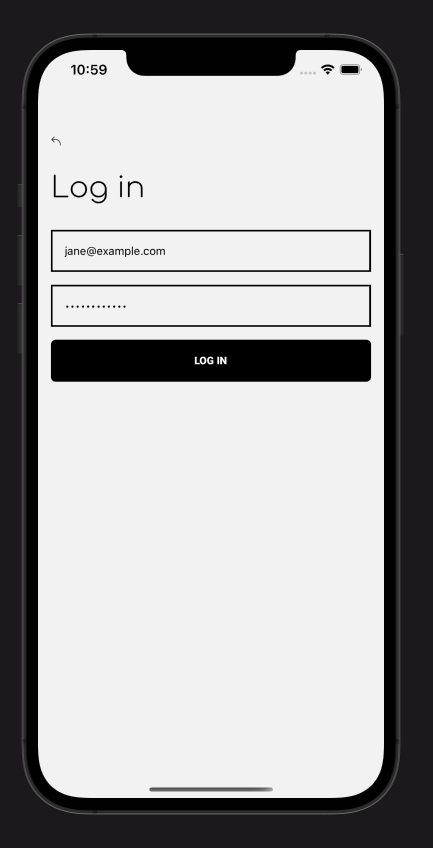
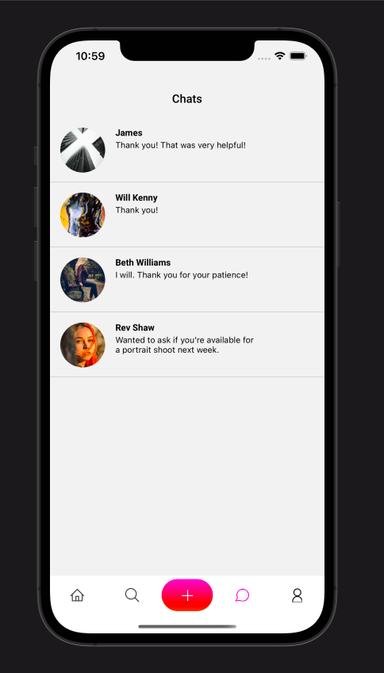
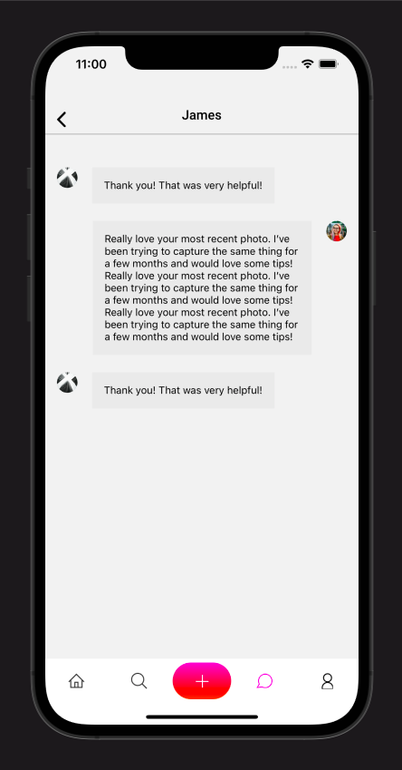
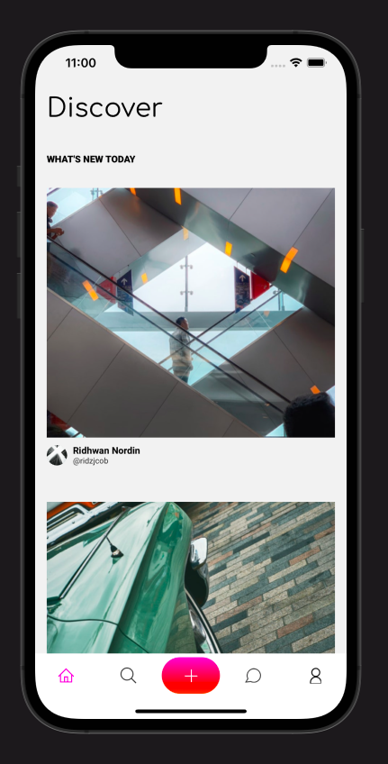

# Discover Socials
### Discover socials is a social media application developed with the React Native Framework.
The code on this repository works for both android and IOS.
For now, all the data in this application are dummy data. 
This design was provided by figma as a walk-through of the figma graphical engine.
I decided to code all the screens using the React Native framework for the frontend and the sanity CMS for backend.

